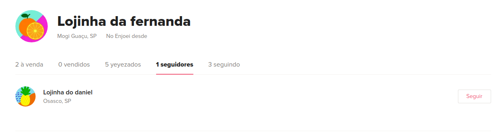

# Case de testes automatizados

A implementação e manutenção de testes automatizados são práticas cotidianas fundamentais da equipe de QA de uma empresa. A medida em que novas funcionalidades surgem, a automação de testes ponta-a-ponta, simulando a experiência do usuário final, é fundamental para garantir que os requisitos do produto sejam atendidos.

Nesse case, você terá a oportunidade de testar uma funcionalidade existente no site do enjoei.

## Configuração inicial

Antes de tudo, baixe esse repositório em sua máquina.

Certifique-se de que você possui as seguintes dependências devidamente instaladas na sua máquina:

* Ruby 2.5.6
  
  Para verificar, execute `ruby -v` a partir da linha de comando.

  Você pode instalar o interpretador de Ruby a partir do [_rvm_](https://rvm.io/rvm/install) ou do [_rbenv_](https://github.com/rbenv/rbenv#installation).
  
  Execute também `gem -v` para verificar se você possui o gerenciador de pacotes do Ruby já instalado.

* Bundle

  Para verificar essa dependência, execute `bundle -v`. Para instalar, use o comando `gem install bundler`.

* Webdriver

  É preciso ainda dispor de um arquivo com o webdriver a ser utilizado nos testes automatizados que você escreverá. O webdriver utilizado dependerá do navegador de sua preferência e de seu sistema operacional. Algumas opções são

  * [ChromeDriver](https://chromedriver.chromium.org/downloads), para o Google Chrome. 

  * [Geckodriver](https://github.com/mozilla/geckodriver/releases), para o Mozilla Firefox

  Você tem liberdade para optar por qualquer outro webdriver de sua preferência. Após ter escolhido o que você vai usar, descompacte o binário na pasta `webdriver` contida nesse repositório. Certifique-se de que esse é o único arquivo presente na pasta. Modifique as linhas 5 e 6 do arquivo `env.rb` para definir o driver de acordo com o navegador que você usa. Por padrão, o projeto está definido para o Google Chrome na versão 83.

  Consulte a [documentação](https://www.rubydoc.info/gems/selenium-webdriver/Selenium/WebDriver) do **Selenium::Webdriver** para saber mais.

  Por fim, execute `bundle install` para instalar o capybara, o cucumber e outras dependências do Ruby a partir do `Gemfile`.

## Deu tudo certo?

  Para verificar se você está pronto para começar o case, o seguinte comando deve realizar um teste que simplesmente acessa a homepage do enjoei e termina com sucesso.

  `cucumber features/test_settings/test_settings.feature `

  Se tudo funciona, você deve ver algo assim:

  ```
  Feature: User settings

  Scenario: Everything's good     # features/test_settings/test_settings.feature:2
    Then I can access enjoei homepage # features/test_settings/test_settings_steps.rb:1

1 scenario (1 passed)
1 step (1 passed)
```

## O que a gente quer que você faça


### item 1.

O site do [enjoei](http://www.enjoei.com.br) apresenta em sua página inicial uma seção que geralmente tem o título **"é desconto que você quer?"** e nela são listadas algumas faixas de preços de produtos que estão a venda, permitindo assim que o usuário categorize a exibição de produtos segundo um _preço máximo_. Pode ser que a seção **é desconto que você quer?** esteja dando lugar a alguma outra, como **hoje a festa é sua**/_festival de descontos_ ou **montão de desconto**.

  
  
  

  Caso você não encontre nenhuma seção com esse título, use qualquer outra seção de desconto existente que esteja em formato semelhante às exibidas anteriormente: uma grade com alguns descontos, geralmente identificados por "até R$ X".

  Nós queremos que você teste essa funcionalidade. No arquivo `features/max_price/max_price.feature` há uma descrição do teste no formato [BDD](https://en.wikipedia.org/wiki/Behavior-driven_development). Seu trabalho é implementar em Ruby os passos descritos, utilizando [Capybara](https://github.com/teamcapybara/capybara#using-capybara-with-cucumber) para descrever o que deve acontecer em cada um deles. Se a etapa de configuração do ambiente funcionou, então você já instalou essa ferramenta em seu ambiente.

  Seu teste deve escolher _aleatoriamente_ um dos preços máximos listados e então, ao clicar nesse preço, verificar se nenhum dos produtos tem preço que ultrapassa esse valor. Escreva seu código com clareza e organização. Sinta-se a vontade para modularizar o seu programa.


### item 2.
No enjoei, os usuários podem seguir uns aos outros através de suas lojinhas.



Queremos escrever um simples caso de teste para garantir a consistência da funcionalidade de seguir usuários no site. Para isso, queremos alguns cenários de testes que verifiquem:

a) se um usuário **A** está seguindo um usuário **B**, então **A** é exibido na lista de seguidores de **B**, mostrada em sua lojinha.

b) se um usuário **A** segue um usuário **B**, então **B** possui pelo menos um seguidor em sua lista.

c) se um usuário **A** não segue um usuário **B**, então **B** não é listado na lista de lojas que **A** está seguindo.

Para esse item, apenas descreva as especificações dos testes em BDD da maneira que você julgar mais adequada, no arquivo `features/follow/follow.feature`. Não é necessário programar os passos, só se você quiser 🙂️

Bom trabalho! 🍀️